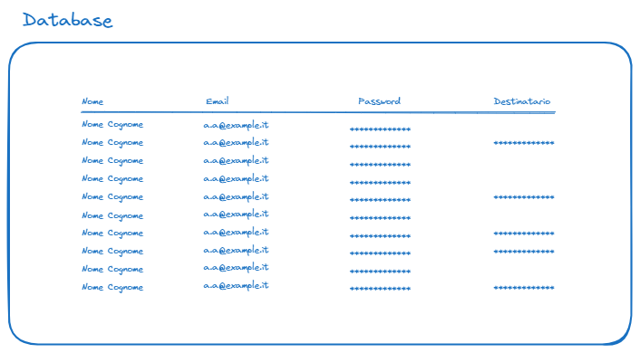

# Analisi

### Database

Il database contiene un'unica collection "User", che contiene i nominativi degli utenti iscritti e il relativo destinatario ("recipient").



### Packages

- **Frontend**: è una SPA realizzata in react, che invoca le api esposte dal servizio di backend utilizzando [la funzione `fetch()` di javascript.](https://developer.mozilla.org/en-US/docs/Web/API/Fetch_API)
- **Backend**: è un'applicazione node.js, sviluppata utilizzando il framework Koa, che espone le [api HTTP consumate dal Frontend](./api.md)
- **Api**: questo package contiene i types typescript condivisi tra Frontend e Backend e funge da reference per i dati passati tramite API

## Logica

### Status

Route: `/`

Api da invocare: `/api/status`

E' la pagina principale, deve invocare l'api `/api/status`, che deve essere invocata all'apertura della pagina e determina la seguente logica:

- **Unauthorized**: redirect verso `/login`
- **WAIT**: mostra la pagina di attesa
- **PLAY**: mostra la pagina da cui si può eseguire l'estrazione (al click sul pulsante invoca l'api `/api/recipextractient`)
- **DONE**: mostra la pagina in cui viene visualizzato il destinatario del regalo (invoca l'api `/api/recipient`)

Dopo aver effettuato il login, l'applicazione invocherà l'api `/api/status` per indirizzare l'utente verso la schermata corretta. [Consulta la documentazione delle API](./api.md) per i dettagli sulla logica associata a questa api.

### Registrazione

Route: `/register`

Api da invocare: `/api/register`

Durante la registrazione l'utente deve fornire:

- nome (first_name)
- cognome (last_name)
- email
- password

### Login

Route: `/login`

Api da invocare: `/api/login`

Il login viene effettuato sui campi `email` e `password`.

### Estrazione

Route: `/extract`

Api da invocare: `/api/extract`

L'estrazione consiste in un servizio che esegua una select di tutti gli utenti nel database ed esegua due filtri:

- rimuovere l'utente corrente, perché non deve essere possibile estrarre sè stesso come destinatario
- rimuovere tutti gli utenti il cui `_id` è già presente nel campo `recipient` di qualche altro utente

#### Esempio:

Data una collection di utenti di questo tipo:

```js
[
  {
    _id: "1",
    email: "a.a@example.it",
    recipient: null,
  },
  {
    _id: "2",
    email: "b.b@example.it",
    recipient: "3",
  },
  {
    _id: "3",
    email: "c.c@example.it",
    recipient: "4",
  },
  {
    _id: "4",
    email: "d.d@example.it",
    recipient: null,
  },
  {
    _id: "5",
    email: "e.e@example.it",
    recipient: null,
  },
];
```

Supponendo che l'utente corrente sia il primo (\_id: "1"), l'estrazione dovrà avvenire selezionando un utente a caso tra "2" e "5" (poiché gli utenti "3" e "4" sono già stati assegnati come "recipient").
