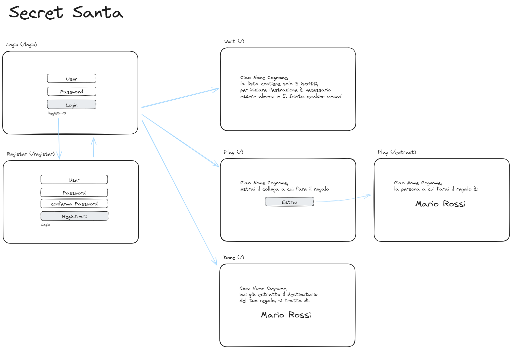
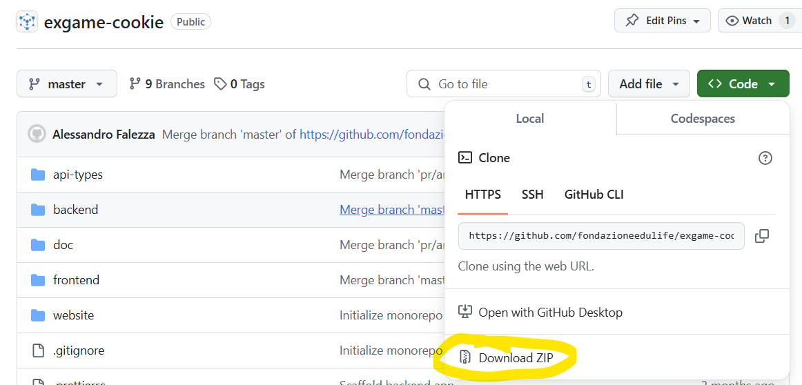

# Esame cookie 2024 - **Secret Santa**

Questo repsitory contiene lo scaffolding del progetto, la [documentazione](#documentazione), la descrizione dei [task](#task-da-eseguire-durante-lesame) da svolgere durante la prova e le [istruzioni per la consegna](#istruzioni-per-la-consegna).

# Descrizione dell'applicazione

L'applicazione "Secret Santa" permette a un gruppo di persone di scambiarsi i regali di Natale estraendo a sorte il nominativo del destinatario. L'applicazione assicura che nessuno rimanga senza regalo e che nessuno riceva più di un regalo.

Lo svolgimento consiste in due fasi:

- **iscrizione**: tramite il form di registrazione, chi lo desidera si iscrive al gioco
- **estrazione**: una volta raggiunto un **numero minimo di 5** giocatori iscritti (configurabile), facendo login è possibile estrarre il destinatario a cui fare il regalo. L'estrazione avviene una volta sola, in modo che il destinatario estratto non sia più modificabile. Se un utente fa nuovamente login dopo aver effettuato l'estrazione, il sistema gli notifica solo il nome del destinatario estratto in precedenza.

### Flow

- accedendo all'url `/` se non è presente una sessione attiva (cookie), si viene indirizzati a `/login`.
- se non ha un account, l'utente può registrarsi sulla pagina `/register`
- una volta effettuato il login, si presenterà una delle seguenti situazioni (vedi grafico qui sopra):
  - numero di iscritti insufficiente per procedere all'estrazione
  - iscrizioni attive, l'utente non ha ancora effettuato l'estrazione. Da qui può estrarre il destinatario, che verrà visualizzato nella schermata successiva
  - estrazione già effettuata per l'utente corrente, viene visualizzato il nome del destinatario

## Documentazione

- [come installare](./doc/install.md)
- [analisi](./doc/analysis.md)
- [api](./doc/api.md)

### Librerie utilizzate

- frontend
  - [React](https://react.dev/learn)
  - [React router](https://reactrouter.com/home)
  - [MUI (joy) - kit di componenti UI](https://mui.com/joy-ui/getting-started/)
- backend
  - [Koa](https://koajs.com/) - [esempi](https://github.com/koajs/examples)
  - [Mongoose](https://mongoosejs.com/docs/guide.html)

# Svolgimento dell'esame

Una volta [installato e avviato il progetto in locale (clicca per le istruzioni)](./doc/install.md), svolgi i seguenti task.

Quando hai terminato, segui le istruzioni per la consegna (vedi sotto).

### Task da eseguire durante l'esame

- Installa l'applicazione e verifica che parta correttamente
- **Task 1** - implementa la funzione di estrazione del destinatario
  - Nel frontend, vedi appunti in [questa pagina: http://localhost:5173/extract](http://localhost:5173/extract)
  - Nel backend, implementa l'api `POST /extract`:
    - estrae un destinatario e lo ritorna
    - Se il destinatario è già stato estratto, ritorna l'estrazione precedente (non dà errore)
- **Task 2** - implementa la funzione di visualizzazione del destinatario, dopo l'estrazione
  - Nel frontend, vedi appunti in [questa pagina: http://localhost:5173](http://localhost:5173) (occhio che questa pagina si può vedere solo dopo aver fatto un'estrazione, per cui è necessario svolgere il task precedente)
  - Nel backend, implementa l'api `GET /recipient`:
    - mostra il destinatario estratto in precedenza
    - Ritorna un 400 se il destinatario non è stato già estratto, l'utente viene redirezionato alla pagina di estrazione (nel frontend)

### Istruzioni per la consegna

- **committa sul tuo branch** tutti gli step, così da poter tornare indietro quando vuoi e non perdere tempo e lavoro durante la prova d'esame
- quando hai finito, esegui git push
- da github, crea una **Pull Request**
- infine, **scarica uno zip** della cartella del progetto dal tuo profilo github e **consegnalo alla commissione d'esame**

## Valutazione

Il risultato dell'esame terrà in considerazione i seguenti parametri:

- numero di task svolti con successo
- qualità del codice prodotto, valutata alla consegna dagli esaminatori

# Suggerimenti

- Per invocere le api, nel frontend devi utilizzare l'hook `useFetch`
- Nel frontend, per invocare le api, utilizza l'`API_BASEPATH` che trovi nel file `config.ts`
- Quando hai scritto le api nel backend, assicurati di invocarle correttamente dal frontend (es: utilizzando il metodo thhp corretto, GET, POST... e il path corretto)
